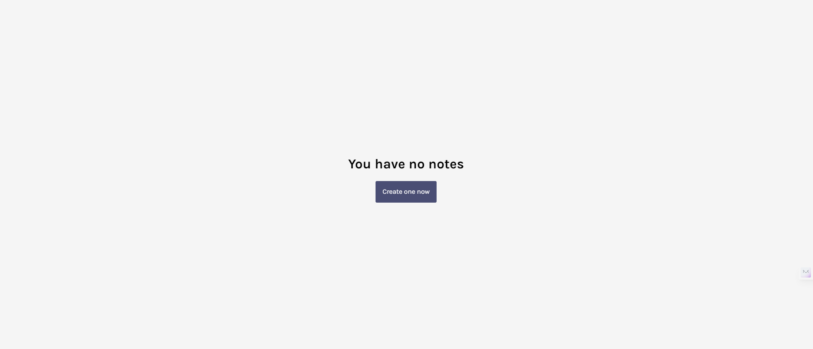
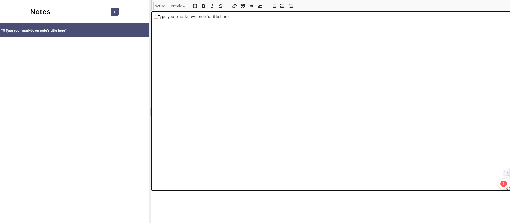
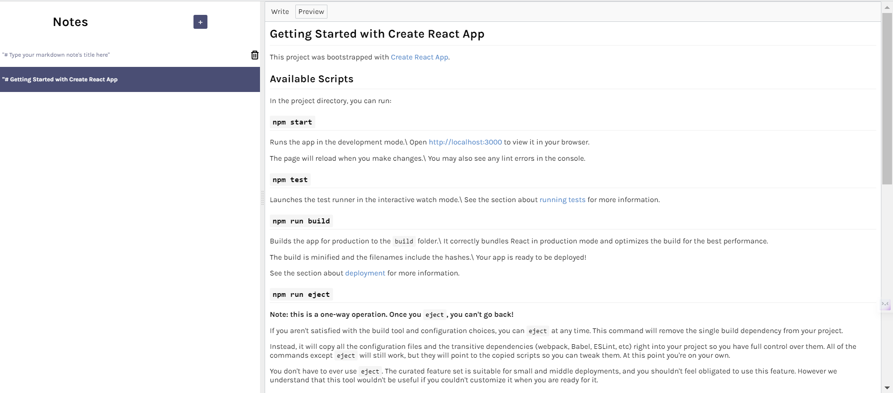
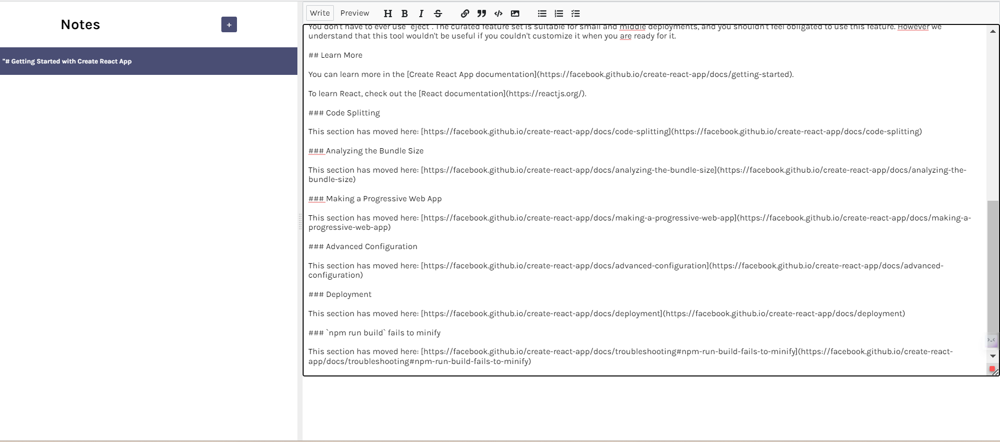

# Markdown Writer

Markdown Writer is a React app that allows you to create, edit, and manage your Markdown notes in a user-friendly interface.

## Features

- Create and manage Markdown notes.
- Split pane interface with sidebar and editor for a seamless experience.
- Real-time Markdown preview using the `react-mde` library.
- Delete notes you no longer need.
- Easy-to-use interface for both experienced and new Markdown users.

## Demo

 ###  Landing Page

 

    ###  Create a New Note  

      
  
    ###  Edit a Note    


    
   ###  Preview a Note


    
   

## Installation and Usage

To run the Markdown Writer app on your local machine, follow these steps:

1. Clone this repository to your local machine:
 
```sh
git clone https://github.com/ShuvoProgram/markdown-creator.git
```


2. Navigate to the project directory:
    
    ```sh
    cd markdown-writer
    ```

3. Install the project dependencies:

    ```sh
    npm install
    ```

4. Start the app:

    ```sh
    npm start
    ```
     
     
5. Open your web browser and go to `http://localhost:3000` to start using the Markdown Writer app.

## Technologies Used

- React: A JavaScript library for building user interfaces.
- react-mde: A Markdown editor built for React applications.
- Showdown: A Markdown to HTML converter.


## Contributing

Contributions are welcome! If you find any issues or want to enhance the app, feel free to submit a pull request.

